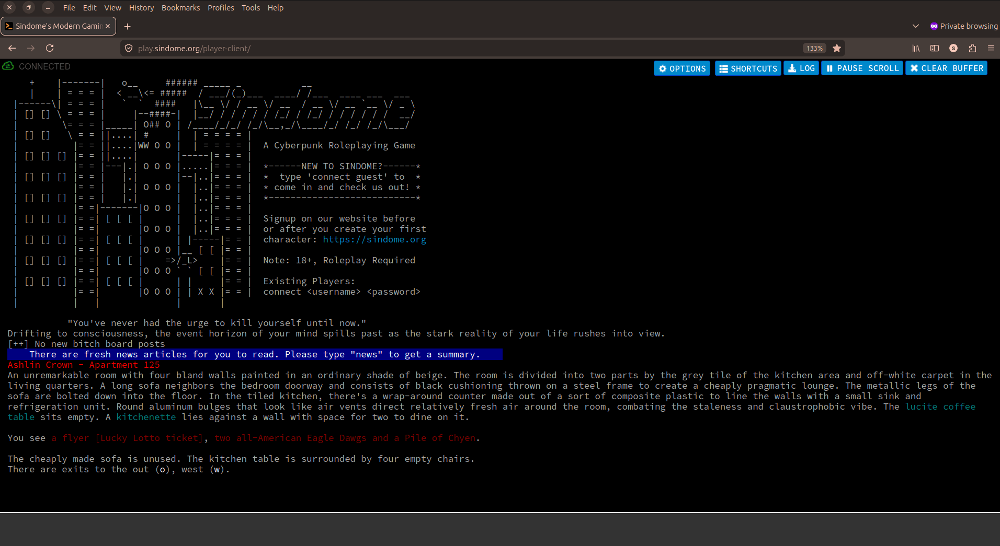
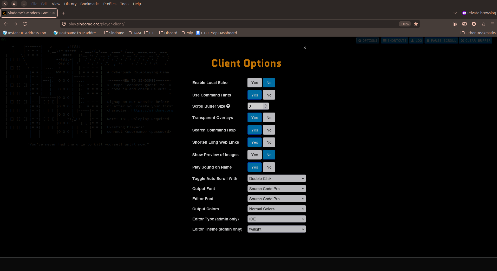
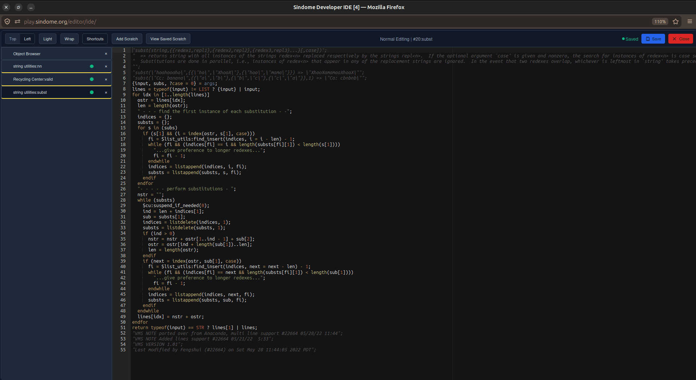
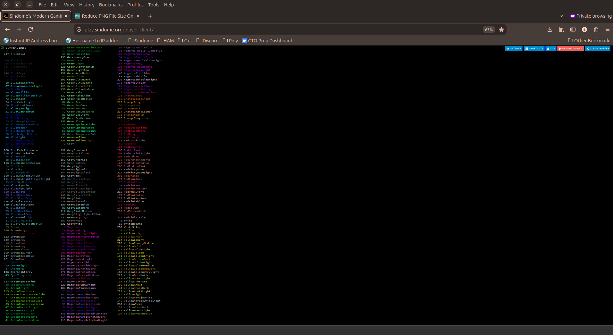
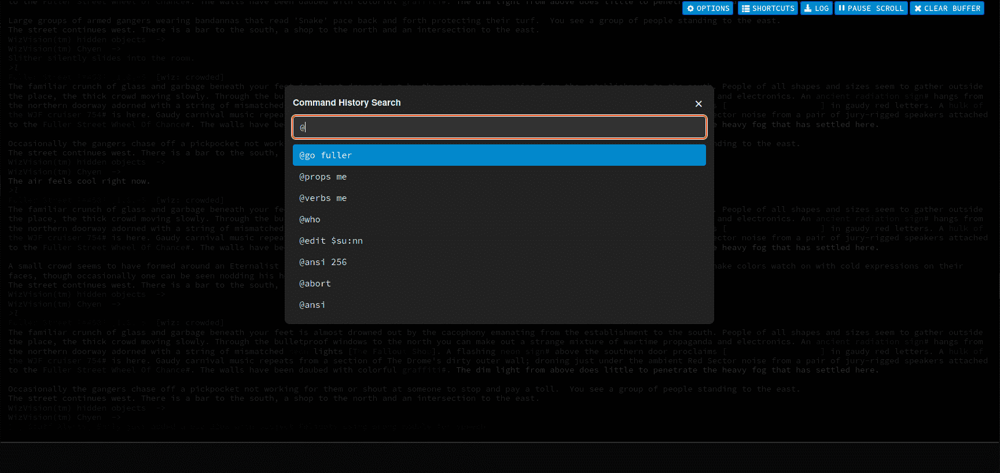

<p align="center"><strong>Dome Client</strong> is a modern WebSocket-powered MUD client with a built-in IDE. Designed for MOOs, but it works for any MUD.</p>
<p align="center">
  
</p>
<br />

[](#requirements)
[](LICENSE.txt)

Dome Client is the maintained successor to the [Legacy Dome Client](https://github.com/javaChilly/dome-client.js), with ongoing fixes, modernized dependencies, a developer IDE for editing MOO verbs & properties, and expanded documentation.

It is a browser-based MUD client built with Node.js, Express, and Socket.io. It bridges browser WebSocket connections to traditional telnet-based MUD servers, so players can connect without installing anything.

## Single-MUD Quick Start
```
git clone git@github.com:SindomeCorp/dome-client.git
cd dome-client
npm i
npm start
```
Open in Browser: http://localhost:8080

This mode uses your configured `MUD_HOST`/`MUD_PORT` as the fixed game to connect to.

## Multi-MUD Quick Start
```bash
git clone git@github.com:SindomeCorp/dome-client.git
cd dome-client
npm i
cp .env-example-local .env
```

Set the following in `.env`:

```env
MULTI_MUD=true
MUD_HOST=default-game-if-user-does-not-enter-one.com
MUD_PORT=default-port
```

Then start:

```bash
npm start
```

Open in Browser: http://localhost:8080

In this mode, the splash page is host/port-first and users can connect to different games; successful connections are tracked in persisted multi-MUD metrics.

**Quick links:** [Installation](#installation) · [Setup Guides](#setup-guides) · [Contributing](#contributing)

## Requirements

- Node.js 22+
- npm

## Features

- Browser-based MUD play over WebSocket with no installation.
- Two connection modes:
  - Single-MUD mode (`MULTI_MUD=false`): fixed game from `MUD_HOST`/`MUD_PORT`.
  - Multi-MUD mode (`MULTI_MUD=true`): user enters host/port to enter connect flow with per-game analytics.
- Terminal-accurate ANSI rendering with a stateful parser (including reset/inverse handling), full Xterm256 support, and TrueColor (`38;2`/`48;2`) foreground/background rendering in both live output and exported logs.
- HTTPS support.
- Automatic URL linkification in output buffer.
- Inline media previews for image/video/YouTube links with expand/collapse toggles.
- Host/IP enrichment for `[host=...]` tokens, with clickable IP/hostname lookup links.
- Copy-friendly wrapping for `#obj` and `$ref`-style tokens in buffer output.
- Regex-based client alerts with optional sound/window attention on match.
- Connection safety UX: disconnect overlay with one-click reconnect, unload warning while connected, and graceful `@quit` on page exit.
- Live health panel with hover/click detail view and rolling CPU/RAM/user charts (when status service is configured).
- Input ergonomics: command history recall, long-input-friendly arrow behavior, and keyboard shortcuts (`Pause/Break`, `Home`, `Insert`, `Ctrl+R`).
- Command history search overlay (`Ctrl+R`) with live filtering, de-duplicated exact matches, keyboard navigation, and one-key insert back into the input buffer.
- Mobile-focused UX: plain-text keyboard hints for command entry (no autocorrect/caps), dedicated up/down history buttons, responsive input sizing, touch-friendly action toolbar, centered overlay dialogs, and guarded clear-buffer confirmation.
- Rich client options: command hints, local echo, image preview, overlay transparency, buffer size, alert sound, font/theme choices, editor mode selection, separate input/output font sizing, configurable input text/background colors, and `Scroll Up to Pause` autoscroll behavior.
- Client options Import/Export workflow: download all preferences as JSON, import recognized keys locally, validate ranges, normalize legacy values, and reset to defaults with explicit confirmation.
- Session log export as HTML for preserving and sharing scrollback, with a client option to switch between default self-contained inline CSS and a lighter legacy linked stylesheet mode.
- Better nowrap output handling via SDWC markers (`SDWC-START-NOWRAP` / `SDWC-END-NOWRAP`) and a mobile-friendly wrap option for long horizontal content.
- Built-in keyboard shortcuts for both client and IDE workflows.
- Optional URL-shortener integration.
- Optional status-service integration.
- Native bridge integration support (`window.DomeBridge` / `window.DomeNative`) for mobile wrappers, including queued startup event handling and native log-download routing when available.
- Fully bundled client styling (local LESS/CSS and glyph assets), removing runtime dependency on external `dome.css` for consistent mobile/desktop rendering.
- Optional multi-game landing mode (`MULTI_MUD`) with host/port-first connect flow and persisted per-game connection analytics.

## Connection Modes

### Single-MUD Mode (`MULTI_MUD=false`)

- Intended for game-specific deployments where the client should always connect to one configured game.
- Splash and metadata are game-name centric (`MOO_NAME` is shown in heading/copy).
- Backend socket connections use `MUD_HOST` and `MUD_PORT` directly.

### Multi-MUD Mode (`MULTI_MUD=true`)

- Intended for hub/public client deployments where users choose host/port at connect time.
- Splash switches to generic **Play Now** with a host/port connect form.
- Client passes selected host/port to the backend per connection.
- `MUD_HOST`/`MUD_PORT` still serve as fallback defaults for empty/invalid user input.
- Successful connections are counted and persisted across restarts in `data/multi-mud-metrics.json`.

## IDE Features

- Built-in IDE editor for verb and property editing, including multi-tab editing workflows.
- Object Browser and Property Browser panes in the IDE for fast navigation across loaded objects.
- Ctrl/Cmd-click code navigation in the IDE (`@edit` target jumps), with optional parent-chain lookup support.
- Hover overlays in the IDE for verb/property metadata lookups via SDWC out-of-band commands.
- Optional VMS note workflow for program saves (can append a commit-style note line after `@program` saves).
- Scratch pad workflow (`@scratch` / `@edit me.scratch`) for temporary editing and recall.
- Optional individual editor-window mode (non-IDE) with unsaved-change protection.

## Screenshots

### Client Options


### IDE Editor


### Xterm256 Color Support


### Command History Search


## Installation

1. Install system dependencies (Ubuntu example):
   ```bash
   sudo apt update
   sudo apt install -y nodejs npm git supervisor
   ```
2. Clone the repository and install npm packages:
   ```bash
   git clone https://github.com/SindomeCorp/dome-client.git
   cd dome-client.js
   npm install
   ```
3. Copy `.env-example-local` (for local/dev) or `.env-example-production` (for production) to `.env` and adjust for your environment.
   - For MOO-side integration, see [docs/MOO-SETUP.md](docs/MOO-SETUP.md)
4. Start the development server:
   ```bash
   npm start
   ```
5. Connect in your browser to the NODE_SOCKET_URL defined in your .env. For example: http://localhost:8080

### Supervisor Deployment

The repository ships with [`supervisor.conf`](supervisor.conf) for managing the process via Supervisor on Ubuntu. Link it into Supervisor's configuration directory and reload:

```bash
sudo ln -s "$(pwd)/supervisor.conf" /etc/supervisor/conf.d/dome-client.conf
sudo supervisorctl reread
sudo supervisorctl update
```

After linking, manage the service with `sudo supervisorctl start dome-client`, `sudo supervisorctl restart dome-client`, etc. Adjust the paths inside `supervisor.conf` if the repository lives somewhere other than `/opt/dome-client`.

## Running without Supervisor

Start the application:

```bash
node src/server.js
```

To run it in the background:

```bash
sudo nohup node src/server.js &
```

On production systems, SSL certificates are typically readable only by root. Start the server with `sudo` so Node can access the key files.

## Project Structure

All application code resides in `src/` and follows a layered design:

- `src/server.js` starts the Express application.
- `src/config/` builds configuration objects from environment variables.
- `src/routes/` maps HTTP routes to controllers.
- `src/controllers/` handle request and response logic.
- `src/services/` contain reusable domain logic.
- `src/middleware/` contains middleware helpers (for example error and LESS middleware).
- `src/logger.js` exposes a shared Winston logger.
- `src/env.js` defines and validates environment variables.
- View templates live in `views/`; see [`views/README.md`](views/README.md) for directory layout and templating guidelines.

Controllers may depend on services and configuration, but services remain independent of Express. Tests live in `test/` and mirror this structure.

## Editor

The in-browser editor uses [Ace](https://ace.c9.io/) v1.43.2 with a custom MOO mode and optional Vim keybindings. Custom modules live under `src/client/ace` and are bundled during the build. Run `npm start` or `npm run build` after editing these modules to regenerate client assets. See [docs/ace-notes.md](docs/ace-notes.md) for details.

## Advanced Setup Guides

### MOO Verbs for Local Editing

If you want the IDE to function properly you'll need to make a few verb changes/additions on your MOO.
- [MOO Verbs Setup](docs/MOO-SETUP.md)

### Advanced Setup
- [Autocomplete](docs/AUTOCOMPLETE.md)
- [URL Shortener](docs/URL-SHORTENER.md)
- [Website Auth](docs/WEBSITE-AUTH.md)
- [Status Service](docs/STATUS-SERVICE.md)

## Dealing with port 80 and file permissions

```bash
sudo setcap 'cap_net_bind_service=+ep' $(which node)
```

## Linting

```bash
npm run lint
```

## Testing

Run the test suite with Node's built-in test runner:

```bash
npm test
```

To enforce 80% line and function coverage with [c8](https://github.com/bcoe/c8):

```bash
npm run coverage
```

The test suite also renders each EJS view to verify templates compile. If you add a template that requires locals, extend the sample-data map in [`test/views.test.js`](test/views.test.js) with representative values.

## Contributing

Run `npm run lint` and `npm test` before committing. Coverage must remain at or above 80%.
